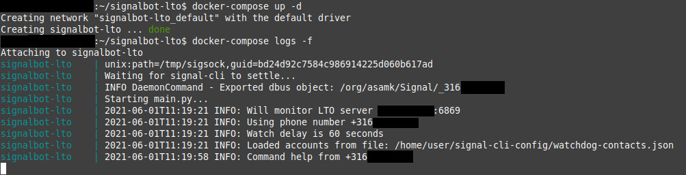
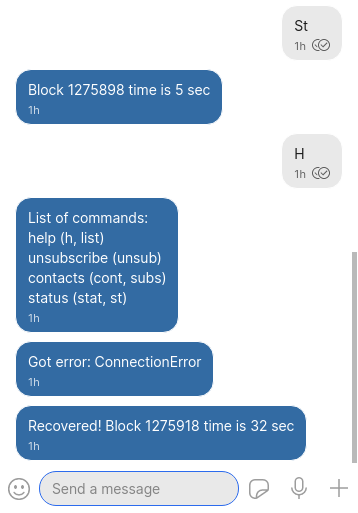

# SignalBot LTO

### NOTICE: LTO has rebranded to EQTY

## Signal chat bot for server monitoring

- License: MIT License
- Author: Matteljay
- Language: Python
- IDE: Visual Studio Code

## Table of contents

- [About](#about)
- [Screenshots](#screenshots)
- [Installation](#installation)
- [Coding details](#Coding-details)
- [Contact info & donations](#contact-info--donations)

## About

SignalBot LTO is an automated [Signal](https://www.signal.org/) chat bot created to offer a third party [watchdog service](https://en.wikipedia.org/wiki/Watchdog_timer) for the [LTO cryptocurrency](https://ltonetwork.com/). It will periodically check the state of the block chain by directly accessing the target node's [Swagger REST API](https://swagger.io/). The main purpose is to verify up-time to make sure a warning message is sent to the LTO server owner when internet connectivity is lost. This project is a complete re-write of [lto-watchdog](https://github.com/Matteljay/lto-watchdog) using the DBus [IPC](https://www.geeksforgeeks.org/inter-process-communication-ipc/) wrapped in a single Docker micro-service.

## Screenshots

## Installation

You need an online private server with Docker and Docker-compose installed. Create a new directory for your project and copy the `docker-compose.yml` file there:

    mkdir -p signalbot-lto/signal-cli-config/
    cd signalbot-lto/
    wget https://github.com/Matteljay/signalbot-lto/raw/main/docker-compose.yml
    nano docker-compose.yml

Make sure to personalize your `docker-compose.yml` by changing the variable `LTO_SERVER_IPPORT` to any LTO Network server you'd like to monitor. The `INTERVAL_SECONDS` variable determines the time interval between checks of the LTO server. If you're not running your own LTO server but would like to test this project anyway, pick a server from [this list](https://lto.tools/nodes/) with an open P2P port (`:6869`).

You now need to register a phone SIM card with signal-cli. This is explained [here](https://github.com/AsamK/signal-cli#usage).

    cp -r ~/.local/share/signal-cli/data/* signal-cli-config/
    sudo chown -R 1000.1000 signal-cli-config/

Alternatively, it is possible to use the docker container by uncommenting `entrypoint: sleep 1h` inside the `docker-compose.yml` file and opening up a shell via `docker exec -it` and using the `--config=/home/user/signal-cli-config` option of the integrated signal-cli, but this is more advanced.

Once your account is set up in `signal-cli-config/` with the correct file permissions, you're ready to launch SignalBot LTO:

    docker-compose up -d
    docker-compose logs -f

Send any message you'd like via Signal to the new SIM number. SignalBot LTO will send you a welcome message and explain which commands it understands.

## Coding details

To get you started customizing this Signal chat bot, the app flow is broken down here succinctly:

[worker/main.py](worker/main.py)
- is the entry point
- registers Linux signals (keyboard interrupts like Ctrl+C)
- verifies some environment variables and checks for signal-cli account registration
- calls Commander to load the custom user subscriptions/privileges
- Commander replies to incoming messages at `handleMessages()`
- calls Watcher which periodically connects to the LTO server's API
- Watcher reports state changes to all subscribed users

## Contact info & donations

More info here: [Contact](CONTACT.md)
